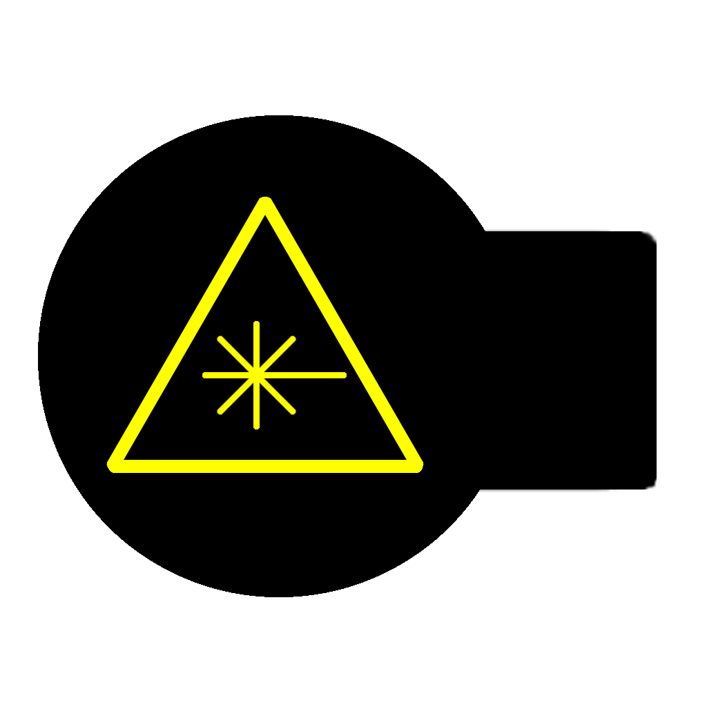
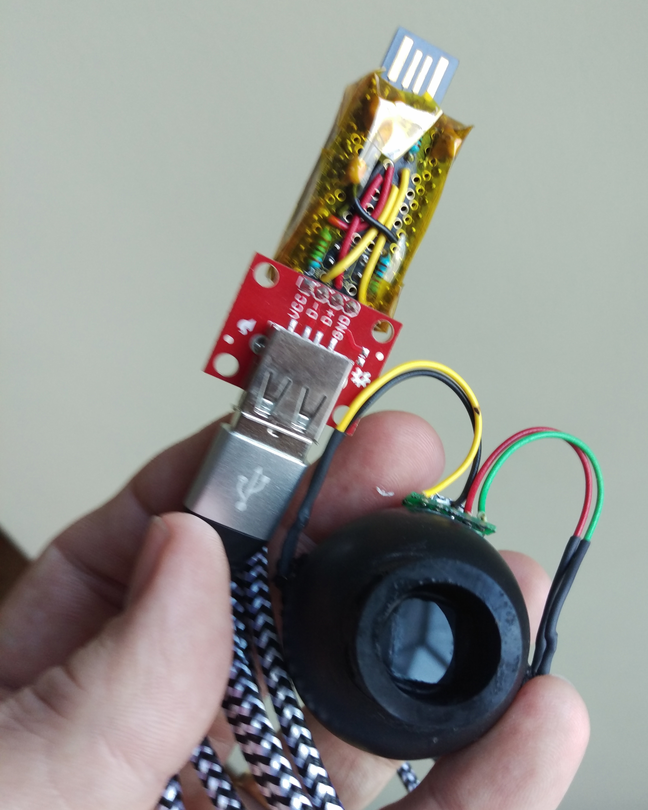
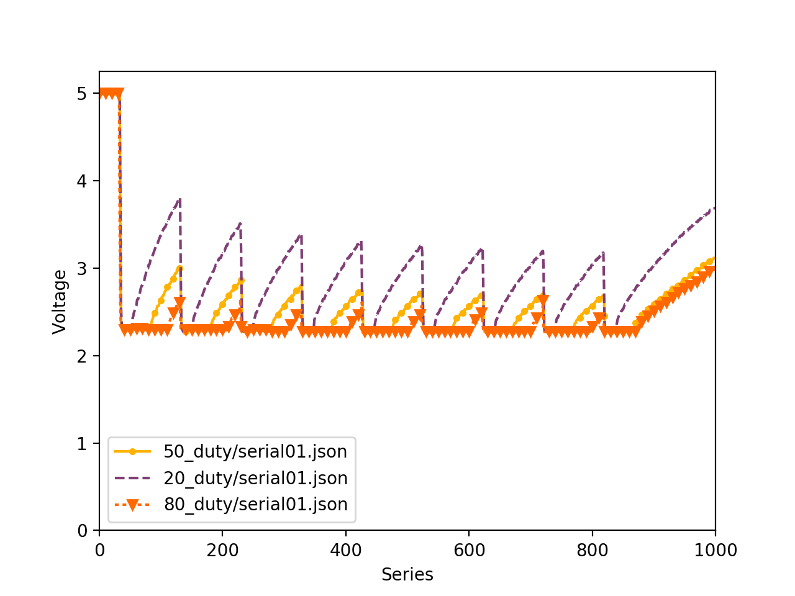
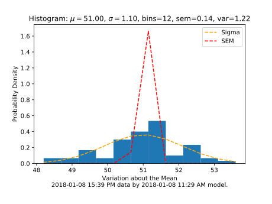
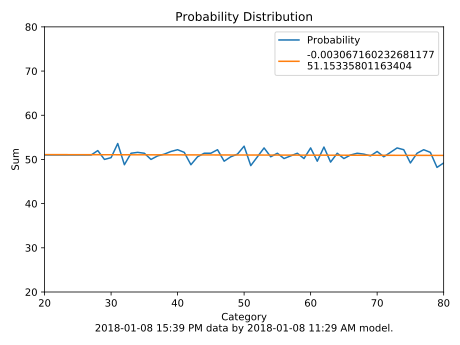

 Laser Power Meter
-----------------
This application provides data collection, statistical analysis, and data visualization for a custom light meter. The meter measures the output of a diode laser using a photo-transistor. This converts the laser's signal into a pulse-width-modulated voltage that is measured by an Arduino [LeoStick](https://www.freetronics.com.au/products/leostick).

This program also fires the laser asynchronously via remote-command-execution on the laser host. The laser firing and data collection subroutine alternates firing and collecting to generate and collect data samples.

The Arduino is connected to the host computer via USB tty. The tty data are collected by means of a Python script that receives JSON formatted data from the Arduino and saves it in files in the applications' data folder. Once all the data files have been collected another Python script runs a machine learning algorithm over the data to produce a model that detects features in the data that allow it to categorize each sample by the duty cycle in the signal.

Repeated measurements of this signal characteristic over time capture the gradual decline in laser power output. This information permits the operator to predict impending laser failure and refurbish the laser. Laser failures waste costly material and upset production schedules. Data visualization is done by another Python script which generates charts.

Credits
-------
<ul class="card-text">
  <li>This application is powered by GitHub <strong>Electron</strong>.</li>
  <li>The responsive design of the user interface is provided
  by <strong>Bootstrap 4</strong>.</li>
  <li>The behavior of the user interface is powered by <strong>jQuery</strong>.
  </li>
  <li>The HTML is made composable by a Node.js package named
    <strong>Cheerio</strong></li>
  <li>The database is <strong>SQL.js</strong>.</li>
  <li>The remote-command-execution is provided by Python <strong>Paramiko
  </strong>.</li>
  <li>The tty integration is provide by Python <strong>pySerial</strong></li>
  <li>The machine learning tools are provide by Python <strong>SciKit-Learn
  </strong>.</li>
  <li>The data visualization are provided by Python <strong>Matplotlib
  </strong>.</li>
  <li>This application was developed using GitHub <strong>Atom</strong> and
    JetBrains <strong>PyCharm CE</strong>.</li>
  <li>Application packaging is provided by <strong>Electron Packager
    </strong> and <strong>Electron Installer DMG.</strong></li>
  <li>The banner art comes from &quot;Teahouse at Koishikawa the morning after
      a snowfall&quot; by <strong>Hokusai Katsushika</strong> (1760-1849).</li>
</ul>
Patrick Moffitt, CSM, M.A. 
January 8, 2018 
